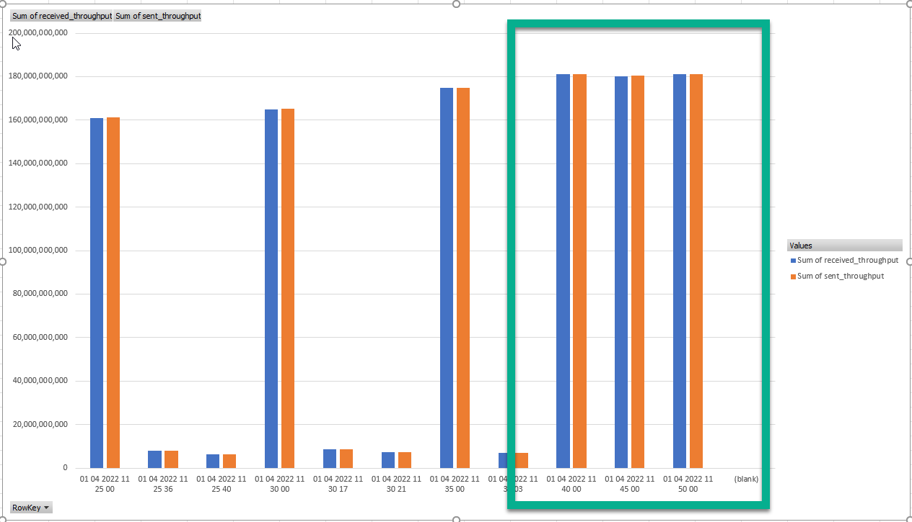
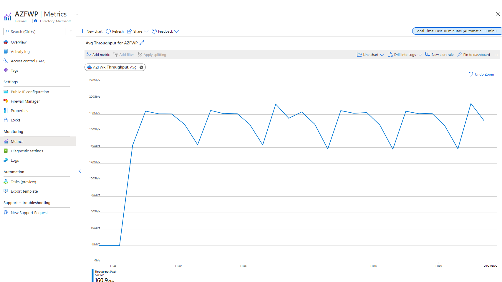
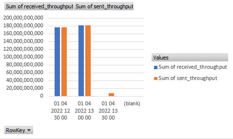
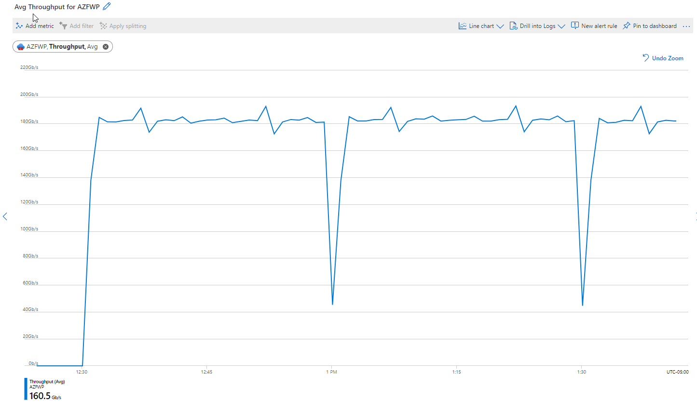
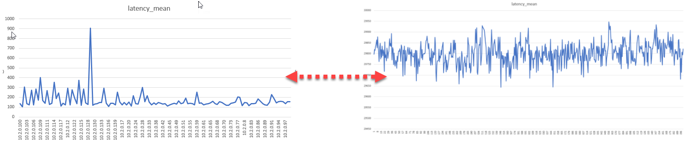

# Azure Firewall premium throughput testing

## Overview

The exercise aims to evaluate how the Azure Firewall Premium SKU performs under stress. A number of variables were measured, including throughput and delay for both IP and HTTP/HTTPS traffic. The performance of the Firewall was evaluated for different modes of IDPS - Alert, Alert and Deny, and Off. Some of the tests were performed without enabling AFWEnableAccelnet. 

In the lab, flows between spokes cross the firewall of the hub. VMSS served as a source and destination for the IP and HTTP(S) flows. VMSS provides on-demand scaling capabilities as well as the ability to control the maximum network bandwidth and maximum number of vCPUs per instance. 

In addition, the scenario of sources and destinations deployed on AKS was tested. We also tested scenarios where Standard Load Balancers were deployed in front of the "servers." Both did not outperform VMSS. 

The topology ( with slight variabions ) for the throughput testing is shown below. This is a classic hub-and-spoke topology with a deployment of Azure Firewall Premium in the hub. 
Deployment code ( terraform ) is in [this](infrastructure/) folder.

The Firewall evaluated from the perspective of :

1. One flow performance ( AFWEnableAccelnet on/off )

1. Combined IP performance ( IDPS Off) ( AFWEnableAccelnet on )

1. IDPS related tests ( AFWEnableAccelnet on ):

   * HTTP(s) throughput ( IDPS Off, Alert, Alert and Deny )

   * IP throughput ( IDPS Off, Alert , Alert and Deny )

   * Relative RTT for IP ( IDPS Off, Alert, Alert and Deny)

   * Relative RTT for HTTP(s) ( IDPS Off, Alert, Alert and Deny)

*) RTT is provided only as a relative measurement.See the note on RTT reporting in iperf3 and vegeta. 


There were four different VM sizes used, namely D4_v4, D5_v2, DS4_v2 and D48_v3.

In comparison to the others, D4_v4 displays the best ratio of vCPU to network performance. Read more on performance data of VMs above [here](https://docs.microsoft.com/en-us/azure/virtual-machines/dv2-dsv2-series) and [here](https://docs.microsoft.com/en-us/azure/virtual-machines/dv2-dsv2-series)

Summary of the VM performance:

| VM size | vCPU | Expected Network bandwidth (Mbps) | Doc
|-----------|---------|--------|-------|
|D4_v4|4|10,000|https://docs.microsoft.com/en-us/azure/virtual-machines/dv4-dsv4-series
|D5_v2|16|12,000|https://docs.microsoft.com/en-us/azure/virtual-machines/dv2-dsv2-series
|DS4_v2|8|6,000|https://docs.microsoft.com/en-us/azure/virtual-machines/dv2-dsv2-series
|D48_v3|48|24,000|https://docs.microsoft.com/en-us/azure/virtual-machines/dv3-dsv3-series

You should consider Azure quotas if you decide to repeat the tests - Azure subscription limits and quotas - https://docs.microsoft.com/en-us/azure/azure-resource-manager/management/azure-subscription-service-limits

Be sure to minimize Firewall transit traffic before changing the IDPS mode. You might see the following error otherwise.


## Baseline tests. 

Learn more about Azure Firewall Performance Boost here - https://docs.microsoft.com/en-us/azure/firewall/firewall-performance. 

Below you will find the results of Iperf3 tests over the Azure Firewall Premium, with the AFWEnableAccelnet is set to False.

### iperf3 spoke1 to spoke2 ( no tunneling )

One Flow (DS4_v2 with AN)
```
azureadmin@spoke1-vm:~$ iperf3 -c 10.1.0.4
Connecting to host 10.1.0.4, port 5201
[  4] local 10.2.0.4 port 45070 connected to 10.1.0.4 port 5201
  
- - - - - - - - - - - - - - - - - - - - - - - - -
[ ID] Interval           Transfer     Bandwidth       Retr
[  4]   0.00-10.00  sec  2.30 GBytes  1.98 Gbits/sec  385             sender
[  4]   0.00-10.00  sec  2.30 GBytes  1.97 Gbits/sec                  receiver
```

64 parallel flows (-P64): (DS4_v2 with AN)
```

[SUM]   0.00-10.00  sec  6.50 GBytes  5.58 Gbits/sec    6             sender
[SUM]   0.00-10.00  sec  6.44 GBytes  5.53 Gbits/sec                  receiver

```
### iperf3 spoke1 to hub (bypassing firewall)

One Flow (DS4_v2 with AN) - There is no doubt that total bandwidth (for both tests) is close to the maximum network performance of the VM. 
```
azureadmin@spoke1-vm:~$ iperf3 -c 10.0.1.4
Connecting to host 10.0.1.4, port 5201
[  4] local 10.2.0.4 port 53928 connected to 10.0.1.4 port 5201
[ ID] Interval           Transfer     Bandwidth       Retr  Cwnd   
- - - - - - - - - - - - - - - - - - - - - - - - -
[ ID] Interval           Transfer     Bandwidth       Retr
[  4]   0.00-10.00  sec  6.66 GBytes  5.72 Gbits/sec    0             sender
[  4]   0.00-10.00  sec  6.65 GBytes  5.72 Gbits/sec                  receiver

iperf Done.
```
64 parallel flows (-P64): (DS4_v2 with AN)

```
[SUM]   0.00-10.00  sec  6.73 GBytes  5.78 Gbits/sec    0             sender
[SUM]   0.00-10.00  sec  6.66 GBytes  5.72 Gbits/sec                  receiver
```

## One Flow performance
### Combining flows with vxlan encapsulation

The best way to combine multiple flows is to wrap them with Vxlan encapsulation: (IPIP and GRE are not permitted in Azure)

```
# spoke1
ip link add vxlan1 type vxlan id 1 remote 10.1.0.4 dstport 4789 dev eth0
ip link set vxlan1 up
ip addr add 10.77.0.1/30 dev vxlan1

# spoke2

ip link add vxlan1 type vxlan id 1 remote 10.2.0.4 dstport 4789 dev eth0
ip link set vxlan1 up
ip addr add 10.77.0.2/30 dev vxlan1
```

```
# spoke to spoke over VXLAN : 64 flows DS4_v2 with AN ; The performance of the session fluctuates between 2.5 Gbps, as expected. 

root@spoke1-vm:~# iperf3 -P 64 -c 10.77.0.2
[SUM]   0.00-10.00  sec  2.89 GBytes  2.48 Gbits/sec  214             sender
[SUM]   0.00-10.00  sec  2.77 GBytes  2.38 Gbits/sec                  receiver

root@spoke1-vm:~# iperf3 -P 128 -c 10.77.0.2
[SUM]   0.00-10.00  sec  2.92 GBytes  2.51 Gbits/sec  1144             sender
[SUM]   0.00-10.00  sec  2.78 GBytes  2.39 Gbits/sec                  receiver
```

``` 
#spoke to spoke over VXLAN : 64 flows : DS5_v2 with AN
[SUM]   0.00-10.00  sec  2.17 GBytes  1.87 Gbits/sec  500             sender
[SUM]   0.00-10.00  sec  2.03 GBytes  1.74 Gbits/sec                  receiver

[SUM]   0.00-10.00  sec  2.26 GBytes  1.94 Gbits/sec  1814             sender
[SUM]   0.00-10.00  sec  2.13 GBytes  1.83 Gbits/sec                  receiver
```

### Register AFWEnableAccelnet feature

To enable the Azure Firewall Premium performance boost, run the following Azure PowerShell commands. This feature is applied at the subscription level for all Firewalls (VNet Firewalls and SecureHub Firewalls). More [here](https://docs.microsoft.com/en-us/azure/firewall/firewall-performance) and [here](https://docs.microsoft.com/en-us/azure/firewall/firewall-preview)


Commands are run in Azure PowerShell to enable the features. For the feature to immediately take effect, an operation needs to be run on the firewall. This can be a rule change (least intrusive), a setting change, or a stop/start operation. Otherwise, the firewall/s is updated with the feature within several days.

```
Select-AzSubscription -Subscription <subscription_name>

Register-AzProviderFeature -Featurename AFWEnableAccelnet  -ProviderNamespace Microsoft.Network

```


Re-testing with VXLAN encapsulation. Spoke to Spoke :

```
# spoke to spoke over VXLAN : 64 flows DS5_v2 with AN

[SUM]   0.00-10.00  sec  6.07 GBytes  5.21 Gbits/sec  2868             sender
[SUM]   0.00-10.00  sec  5.94 GBytes  5.10 Gbits/sec                  receiver

[SUM]   0.00-10.00  sec  5.70 GBytes  4.90 Gbits/sec  496             sender
[SUM]   0.00-10.00  sec  5.60 GBytes  4.81 Gbits/sec                  receiver

[SUM]   0.00-10.00  sec  5.39 GBytes  4.63 Gbits/sec   38             sender
[SUM]   0.00-10.00  sec  5.30 GBytes  4.55 Gbits/sec                  receiver


# spoke to spoke over VXLAN : 64 flows DS4_v2 with AN

[SUM]   0.00-10.00  sec  5.70 GBytes  4.90 Gbits/sec  496             sender
[SUM]   0.00-10.00  sec  5.60 GBytes  4.81 Gbits/sec                  receiver

[SUM]   0.00-10.00  sec  6.64 GBytes  5.71 Gbits/sec  4840             sender
[SUM]   0.00-10.00  sec  6.61 GBytes  5.68 Gbits/sec                  receiver

[SUM]   0.00-10.00  sec  6.64 GBytes  5.71 Gbits/sec  4840             sender
[SUM]   0.00-10.00  sec  6.61 GBytes  5.68 Gbits/sec                  receiver


```

Throughput between hub and spoke directly (bypassing Firewall) over VXLAN.


Configuration

```
# spoke1
ip link add vxlan2 type vxlan id 2 remote 10.0.1.4 dstport 4789 dev eth0
ip link set vxlan2 up
ip addr add 10.78.0.1/30 dev vxlan2

# hub

ip link add vxlan2 type vxlan id 2 remote 10.2.0.4 dstport 4789 dev eth0
ip link set vxlan2 up
ip addr add 10.78.0.2/30 dev vxlan2
```

Results

```
on DS4_v2 with AN spoke to hub , bypassing firewall . vxlan 1 to vxlan 2 , 64 flows

[SUM]   0.00-10.00  sec  6.52 GBytes  5.60 Gbits/sec    0             sender
[SUM]   0.00-10.00  sec  6.44 GBytes  5.53 Gbits/sec                  receiver

```

What does the above result mean? 

When AFWEnableAccelnet is enabled, the performance of the single flow reaches the maximum allowed by the virtual machine. 

### Test based on Standard_D48_v3

Summary : The max performance of one flow is close to 10Gbps. Even on VMs that can handle 24Gbps, a single transit flow through Azure Firewall is limited to 10Gbps. This is 4x better than 2.5Gbps Firewall performance with AFWEnableAccelnet is disabled. 

| Test Case  | VM size | Src | Dst | Encap | Proto | Flows | Performance | Note |
|-----------|---------|--------|-------------|---------------|----------|       :-:       |     :-:     |  :-: |
| 1. One flow iperf3 spoke to spoke | Standard_D48_v3 [24 Mbps](https://docs.microsoft.com/en-us/azure/virtual-machines/dv3-dsv3-series) | spoke1 (10.2.0.4) | spoke2 (10.1.0.4) | native | iperf3 | 1 | 9.33 Gbits/sec | [linky](#test-case-1---iperf3-one-flow)
| 2. 64 flows iperf3 spoke to spoke | Standard_D48_v3 [24 Mbps](https://docs.microsoft.com/en-us/azure/virtual-machines/dv3-dsv3-series) | spoke1 (10.2.0.4) | spoke2 (10.1.0.4) | native | iperf3 | 64 | 13.9 - 9.55 Gbit/sec| [linky](#test-case-2---64-flows-iperf3-spoke-to-spoke)
| 3. One flow iperf3 spoke to spoke encapsulated to VXLAN | Standard_D48_v3 [24 Mbps](https://docs.microsoft.com/en-us/azure/virtual-machines/dv3-dsv3-series) | spoke1 (10.77.0.1) | spoke2 (10.77.0.2) | VXLAN | iperf3 | 1 | 1.33 Gbits/sec | [linky](#test-case-3---one-flow-spoke-to-spoke-iperf3-encapsulated-to-vxlan)
| 4. 64 flows iperf3 spoke to spoke encapsulated to VXLAN | Standard_D48_v3 [24 Mbps](https://docs.microsoft.com/en-us/azure/virtual-machines/dv3-dsv3-series) | spoke1 (10.77.0.1) | spoke2 (10.77.0.2) | VXLAN | iperf3 | 64 | 11.6 Gbits/sec | [linky](#test-case-4---64-flows-spoke-to-spoke-iperf3-encapsulated-to-vxlan)
| 5. One flow ftp spoke to spoke | Standard_D48_v3 [24 Mbps](https://docs.microsoft.com/en-us/azure/virtual-machines/dv3-dsv3-series) | spoke1 (10.2.0.4) | spoke2 (10.1.0.4) | native | ftp | 1 | 310.38 MB/s = 2480 Mbps | [linky](#test-case-5---one-flow-spoke-to-spoke-ftp)
| 6. 64 flows lftp spoke to spoke encapsulated to VXLAN | Standard_D48_v3 [24 Mbps](https://docs.microsoft.com/en-us/azure/virtual-machines/dv3-dsv3-series) | spoke1 (10.77.0.1) | spoke2 (10.77.0.2) | VXLAN | lftp | 64 | 300 MiB/sec = 2516 Mbps| [linky](#test-case-6---64-flows-spoke-to-spoke-lftp-encapsulated-to-vxlan)
| 7. One flow iperf3 spoke to spoke | Standard_DS5_v2 [12 Mbps](https://docs.microsoft.com/en-us/azure/virtual-machines/dv2-dsv2-series) | spoke1 (10.2.0.4) | spoke2 (10.1.0.4) | native | iperf3 | 1 | 9.42 Gbps/s | [linky](#test-case-7-one-flow-iperf3-spoke-to-spoke)
| 8. 64 flows iperf3 spoke to spoke | Standard_DS5_v2 [12 Mbps](https://docs.microsoft.com/en-us/azure/virtual-machines/dv2-dsv2-series) | spoke1 (10.2.0.4) | spoke2 (10.1.0.4) | native | iperf3 | 64 | 10.9 Gbps/s| [linky](#test-case-8-64-flows-iperf3-spoke-to-spoke)
| 9. One flow iperf3 spoke to spoke encapsulated to VXLAN |Standard_DS5_v2 [12 Mbps](https://docs.microsoft.com/en-us/azure/virtual-machines/dv2-dsv2-series)| spoke1 (10.77.0.1) | spoke2 (10.77.0.2) | VXLAN | iperf3 | 1 | 1.37 Gbps/s | [linky](#test-case-9-one-flow-iperf3-spoke-to-spoke-encapsulated-to-vxlan)
| 10. 64 flows iperf3 spoke to spoke encapsulated to VXLAN | Standard_DS5_v2 [12 Mbps](https://docs.microsoft.com/en-us/azure/virtual-machines/dv2-dsv2-series) | spoke1 (10.77.0.1) | spoke2 (10.77.0.2) | VXLAN | iperf3 | 64 | 10.7 Gbps/s | [linky](#test-case-10-64-flows-iperf3-spoke-to-spoke-encapsulated-to-vxlan)

How would you interpret the above result? 

When AFWEnableAccelnet is enabled, the performance of the single flow reaches the 10Gbps. 

Further details about the tests summarized in the above table can be found below

### Test case 1 - One flow iperf3 spoke to spoke

spoke1 
```
iperf3 -c 10.1.0.4

[ ID] Interval           Transfer     Bandwidth       Retr
[  4]   0.00-10.00  sec  10.9 GBytes  9.33 Gbits/sec  1208             sender
[  4]   0.00-10.00  sec  10.9 GBytes  9.33 Gbits/sec                  receiver

[  4]   0.00-10.00  sec  11.0 GBytes  9.42 Gbits/sec  621             sender
[  4]   0.00-10.00  sec  11.0 GBytes  9.42 Gbits/sec                  receiver
```
spoke2 
```
iperf3 -s
```

### Test case 2 - 64 flows iperf3 spoke to spoke

spoke1 
```
iperf3 -c 10.1.0.4 -P 64

[SUM]   0.00-10.00  sec  16.2 GBytes  13.9 Gbits/sec  6198             sender
[SUM]   0.00-10.00  sec  16.1 GBytes  13.8 Gbits/sec                  receiver

[SUM]   0.00-10.00  sec  11.1 GBytes  9.55 Gbits/sec  10512             sender
[SUM]   0.00-10.00  sec  11.0 GBytes  9.46 Gbits/sec                  receiver

[SUM]   0.00-10.00  sec  11.1 GBytes  9.53 Gbits/sec  17613             sender
[SUM]   0.00-10.00  sec  11.0 GBytes  9.47 Gbits/sec                  receiver

```
spoke2 
```
iperf3 -s
```

### Test case 3 - One flow spoke to spoke iperf3 encapsulated to VXLAN
spoke1 
```
ip link add vxlan1 type vxlan id 1 remote 10.1.0.4 dstport 4789 dev eth0
ip link set vxlan1 up
ip addr add 10.77.0.1/30 dev vxlan1

iperf3 -c 10.77.0.2

[ ID] Interval           Transfer     Bandwidth       Retr
[  4]   0.00-10.00  sec  1.25 GBytes  1.08 Gbits/sec   62             sender
[  4]   0.00-10.00  sec  1.25 GBytes  1.08 Gbits/sec                  receiver

[ ID] Interval           Transfer     Bandwidth       Retr
[  4]   0.00-10.00  sec  1.55 GBytes  1.33 Gbits/sec   90             sender
[  4]   0.00-10.00  sec  1.55 GBytes  1.33 Gbits/sec                  receiver
```


spoke2
```
ip link add vxlan1 type vxlan id 1 remote 10.2.0.4 dstport 4789 dev eth0
ip link set vxlan1 up
ip addr add 10.77.0.2/30 dev vxlan1

iperf3 -s -i vxlan1
```

### Test case 4 - 64 flows spoke to spoke iperf3 encapsulated to VXLAN
spoke1 
```
ip link add vxlan1 type vxlan id 1 remote 10.1.0.4 dstport 4789 dev eth0
ip link set vxlan1 up
ip addr add 10.77.0.1/30 dev vxlan1

iperf3 -c 10.77.0.2 -P64

[SUM]   0.00-10.04  sec  11.0 GBytes  9.38 Gbits/sec  5267             sender
[SUM]   0.00-10.04  sec  10.9 GBytes  9.35 Gbits/sec                  receiver

[SUM]   0.00-10.00  sec  8.25 GBytes  7.08 Gbits/sec  1747             sender
[SUM]   0.00-10.00  sec  8.25 GBytes  7.08 Gbits/sec                  receiver

[SUM]   0.00-10.03  sec  13.5 GBytes  11.6 Gbits/sec  4488             sender
[SUM]   0.00-10.03  sec  13.3 GBytes  11.4 Gbits/sec                  receiver
```

spoke2
```
ip link add vxlan1 type vxlan id 1 remote 10.2.0.4 dstport 4789 dev eth0
ip link set vxlan1 up
ip addr add 10.77.0.2/30 dev vxlan1

iperf3 -s -i vxlan1
```

### Test case 5 - One flow spoke to spoke ftp 
spoke1
```
apt-get install ncftp

ncftp / > get 10gb-file
10gb-file:                                               9.31 GB  103.35 MB/s 
ncftp / > get 10gb-file
10gb-file:                                               9.31 GB  310.38 MB/s
```
spoke2
```
apt-get install proftpd
# enable anonymous access ( /etc/proftpd/proftpd.conf )
cd /srv/ftp 
dd if=/dev/urandom of=10gb-file bs=1000000000 count=10 iflag=fullblock # takes about 2-3 min
#    root@spoke2-vm:/srv/ftp# ls -lah
#    total 9.4G
#    drwxr-xr-x 2 ftp  nogroup 4.0K Dec 22 14:04 .
#    drwxr-xr-x 3 root root    4.0K Dec 22 13:50 ..
#    -rw-r--r-- 1 root root    9.4G Dec 22 14:08 10gb-file
#    -rw-r--r-- 1 root root     170 Mar 12  2018 welcome.msg
```

### Test case 6 - 64 flows spoke to spoke lftp encapsulated to VXLAN

Iperf3 is, in fact, the best performance testing tool. It is extremely difficult to fill up a pipe completely using ftp. 

spoke1
```
lftp -e 'pget -n 64 ftp://10.77.0.2/10gb-file;quit'

10000000000 bytes transferred in 31 seconds (305.19 MiB/s)

```

### Test case 7. One flow iperf3 spoke to spoke 
```
- - - - - - - - - - - - - - - - - - - - - - - - -
[ ID] Interval           Transfer     Bandwidth       Retr
[  4]   0.00-10.00  sec  10.8 GBytes  9.30 Gbits/sec  2487             sender
[  4]   0.00-10.00  sec  10.8 GBytes  9.29 Gbits/sec                  receiver

[ ID] Interval           Transfer     Bandwidth       Retr
[  4]   0.00-10.00  sec  11.0 GBytes  9.42 Gbits/sec  1410             sender
[  4]   0.00-10.00  sec  11.0 GBytes  9.41 Gbits/sec                  receiver
```
### Test case 8. 64 flows iperf3 spoke to spoke 

```
[SUM]   0.00-10.00  sec  12.7 GBytes  10.9 Gbits/sec  13621             sender
[SUM]   0.00-10.00  sec  12.6 GBytes  10.9 Gbits/sec                  receiver

[SUM]   0.00-10.00  sec  12.7 GBytes  10.9 Gbits/sec  6427             sender
[SUM]   0.00-10.00  sec  12.7 GBytes  10.9 Gbits/sec                  receiver
```

### Test case 9. One flow iperf3 spoke to spoke encapsulated to VXLAN 
```
[ ID] Interval           Transfer     Bandwidth       Retr
[  4]   0.00-10.00  sec  1.59 GBytes  1.37 Gbits/sec   84             sender
[  4]   0.00-10.00  sec  1.59 GBytes  1.37 Gbits/sec                  receiver

[ ID] Interval           Transfer     Bandwidth       Retr
[  4]   0.00-10.00  sec  1.59 GBytes  1.37 Gbits/sec   84             sender
[  4]   0.00-10.00  sec  1.59 GBytes  1.37 Gbits/sec                  receiver
```
### Test case 10. 64 flows iperf3 spoke to spoke encapsulated to VXLAN 
```
[SUM]   0.00-10.00  sec  12.5 GBytes  10.7 Gbits/sec  17549             sender
[SUM]   0.00-10.00  sec  12.4 GBytes  10.6 Gbits/sec                  receiver
```

## Combined throughput on max-pre-scaled Firewall Premium. 

The purpose of the test is to max out the Firewall's combined performance. The following three methods were used in order to verify the performance of the Firewall Premium prescaled to 20 instances:

1. iperf3 30 sec, short-duration flows in VMSS , combined over 30 instances
2. iperf3 280 sec , longer-duration flows, with 64x multiplier , combined over 30 instances. Compared with AZFW Throughput Metrics
3. iperf3 29 min (1740 sec) , jumbo flows, with 64x multiplier , combined over 30 instances. Compared with AZFW Throughput Metrics

All three methods above provide an average 180Gbps performance with unsignificant devaiation. 

Topology below were used for test:


Notes about implementation:

1. Client/Server architecture were used
2. Clients/Servers were implemented as VMSS
3. Clients and Servers are NTP-synchronized
4. Azure Service Bus queue were used for feeding client pool with server IP addresses 
5. Azure Table Store used for statistics collection
6. VMSS were built based on [Standard_D4_v4](https://docs.microsoft.com/en-us/azure/virtual-machines/dv4-dsv4-series) ( 4 cores, 10Gbps network performance ) 
7. 30 instances should be enough to cover potential max of the AZFW ( 20 * 10Gbps < 30 * 10Gbps)

### iperf3 30 sec, short-duration flows in VMSS , combined over 30 instances

[Statistics collected from 30 clients](supplementals/stats/stats-30sec-30instances.xlsx)

Visualization ( aggregate ):


### iperf3 280 sec , longer-duration flows, with 64x multiplier , combined over 30 instances. Compared with AZFW Throughput Metrics

[Statistics collected from 30 clients](supplementals/stats/stats-280sec-30instances.xlsx)

Visualization ( aggregate ), Note the throughput is symmetrical



Metrics ( AZFW Throughput )



### iperf3 29 min (1740 sec) , jumbo flows, with 64x multiplier , combined over 30 instances. Compared with AZFW Throughput Metrics

[Statistics collected from 30 clients](supplementals/stats/stats-1740sec-30instances.xlsx)

Visualization ( aggregate ), Note the throughput is symmetrical





## RTT measurements in iperf3 and vegeta

RTT data is only provided as a relative and comparative measure. In a hub-spoke environment with IDPS off, round trip time from VM to VM is 2.35 milliseconds.

Iperf3 and vegeta use different reporting methods. Additionally, server processing delays need to be taken into consideration. Accordingly, you should only use them relative to the other measurements I mentioned above. 
For example, you can compare RTT for transit traffic with IDPS OFF versus IDPS Alert and Deny and see the percentage of change. Take the scale into consideration!



### Iperf3 latency calculation/reporting 

As per [esnet/iperf](https://github.com/esnet/iperf/commit/432ef7ebb3abfedcb87b717b251eb72fc1a2d0c3) :

>Retrieve RTT information on platforms supporting it.
This value is available on the sender side, expressed in
microseconds.  It's available in the JSON output.

>In the JSON output we also output the maximum observed RTT
per-stream.  Note that since the observation interval is many times
the RTT, it's not clear how good this value would be at capturing the
largest computed RTT value over the lifetime of each stream.

>While here, also determine the maximum observed snd_cwnd value over
the lifetime of each stream.

>This all works pretty well on Linux, but on FreeBSD (which should
theoretically be supported) we don't do a good job of supporting the
tcp_info structure.  We need to make this code a lot more portable,
rather than just assuming the world of platforms is "Linux"
vs. "everything else".  Fixing this requires some rearchitecting of
the way that we retrieve, compute, and print statistics.

RTT returned in [usec](https://github.com/esnet/iperf/blob/332c31ee6512514c216077407a725b5b958b1582/src/tcp_info.c#L168)

Why IPERF3 reported latency is differs from icmp/ping ?
>
>This is due to the standard package size in iperf3, in TCP this is 8KB, 1470 bytes for UDP. When using ping it is 56 bytes by default. Try specifying the --length flag in iperf3 and you will see similar RTT times. Note that you will never get exactly the same result because ping uses ICMP (which is a network layer protocol), whereas iperf3 is on the transport layer.

[orig](https://github.com/esnet/iperf/issues/635#issuecomment-1022254224)
>
```
azureadmin@spoke1-vm:~$ ping 10.1.0.4
PING 10.1.0.4 (10.1.0.4) 56(84) bytes of data.
64 bytes from 10.1.0.4: icmp_seq=1 ttl=63 time=4.52 ms
64 bytes from 10.1.0.4: icmp_seq=2 ttl=63 time=2.35 ms
64 bytes from 10.1.0.4: icmp_seq=3 ttl=63 time=2.34 ms
64 bytes from 10.1.0.4: icmp_seq=4 ttl=63 time=2.26 ms
^C
--- 10.1.0.4 ping statistics ---
4 packets transmitted, 4 received, 0% packet loss, time 3004ms
rtt min/avg/max/mdev = 2.265/2.874/4.529/0.956 ms

Reported by iperf3 :  ( iperf3 --length 56 -P64 -t 180 -c 10.1.0.4 -J )

 "max_snd_cwnd": 57288,
 "max_rtt":      8092,
 "min_rtt":      478,
 "mean_rtt":     1290

```
### Vegeta latency calculation/reporting 

To convert vegeta-reported lateny to ms divide the result by 1,000,000

```
echo "GET http://10.1.0.5" | vegeta attack -duration=10s -insecure -rate=50 | vegeta report
Latencies     [min, mean, 50, 90, 95, 99, max]  53.076ms, 65.005ms, 62.132ms, 69.608ms, 79.67ms, 112.85ms, 192.376ms

{
  "latencies": {
    "total": 38415392406,
    "mean": 76830784,
    "50th": 64352932,
    "90th": 109928619,
    "95th": 117367639,
    "99th": 206221839,
    "max": 374886829,
    "min": 50137960
  }

 65ms ~~  76830784/1000000
```

## Throughput and RTT for HTTP(s) and IP traffic with different IDPS modes


We used vegeta ( https://github.com/tsenart/vegeta ) and nginx ( https://github.com/nginx/nginx ) in client/server scenario for load generation. VMSS of different sizes ( 40 - 120 ) used for testing. 

Vegeta used with the rate set to 50 for http(s), nginx generate 1Mb random file. 

In summary, with IDPS off, the http(s) throughput is proportional to the size of VMSS, but with IDPS set to Alert and Deny, the throughput dropped to 9Gbps. With Alert, performance was decreased by 10%. Read more below. 

Additionally, we have tested scenarios where source/destinations are set up on AKS clusters. We also tested the scenario with a standard load balancer in front of the servers. Both of them have not provided any performance benefits, despite rebalancing sources and destinations. 


### IDPS-Off-D4-v4-vegeta-http-rate-50-1M-reply-240-instances-5-min

Variables:
```
# terraform.tfvars:
idps = "Off"

vmss_size = "Standard_D2_v4"

# clients.txt:
test_type = "vegeta" 
duration  = 5 # in minutes 
protocol = "http" # vegeta specific


./manual_vmss_scaling.sh 240 # az cli scaling is much faster than with terraform
```

* Throughput : ~ 54Gbps 
* Latency mean : 209.7ms  ( include server processing delay )
  
[stats](/supplementals/stats/stats-IDPS-Off-D4-v4-vegeta-http-rate-50-1M-reply-120-instances-5-min.csv)


### IDPS-Off-D4-v4-vegeta-https-rate-50-1M-reply-240-instances-5-min

Variables:
```
# terraform.tfvars:
idps = "Off"

vmss_size = "Standard_D2_v4"

testtype = "vegeta"
testduration  = 5 
testprotocol = "https" 


./manual_vmss_scaling.sh 240 # az cli scaling is much faster than with terraform
```

* Throughput : ~52Gbps
* Latency mean : 227.16ms  ( include server processing delay )

[stats](/supplementals/stats/stats-IDPS-Off-D4-v4-vegeta-https-rate-50-1M-reply-120-instances-5-min.csv)


### IDPS-Off-D4-v4-iperf3-64-30-instances-5-min

Variables:
```

# terraform.tfvars:
idps = "Off"
testtype = "iperf3"

vmss_size = "Standard_D4_v4"

testduration  = 5
testprotocol = "" 
testiperf3flows = "64"


./manual_vmss_scaling.sh 30 # az cli scaling is much faster than with terraform
```

* Throughput Gbps: 140Gbps
* Latency mean : 36854.53571

[stats](/supplementals/stats/stats-IDPS-Off-D4-v4-iperf3-64-30-instances-10-min.csv)


### IDPS-Alert-D4-v4-vegeta-http-rate-50-1M-reply-120-instances-5-min

Variables:
```
# terraform.tfvars:
idps = "Alert"
testtype = "vegeta"
testduration  =  5
testprotocol = "http" 

./manual_vmss_scaling.sh 120 # az cli scaling is much faster than with terraform
```

* Throughput : ~45Gbps
* Latency mean : 14359.77058  ( include server processing delay )

[stats](/supplementals/stats/stats-IDPS-Alert-D4-v4-vegeta-http-rate-50-1M-reply-120-instances-5-min.csv)


### IDPS-Alert-D4-v4-vegeta-https-rate-50-1M-reply-120-instances-5-min

Variables:
```
# terraform.tfvars:
idps = "Alert"
testtype = "vegeta"
testduration  =  5
testprotocol = "https" 

./manual_vmss_scaling.sh 120 # az cli scaling is much faster than with terraform
```

* Throughput : ~54 Gbps
* Latency mean : 2281.117052  ( include server processing delay )

[stats](/supplementals/stats/stats-IDPS-Alert-D4-v4-vegeta-https-rate-50-1M-reply-120-instances-5-min.csv)


### IDPS-Alert-D4-v4-iperf3-64-30-instances-5-min

Variables:
```
# terraform.tfvars:
idps = "Alert"
testtype = "iperf3"

vmss_size = "Standard_D4_v4"

testduration  = 5
testprotocol = "" 
testiperf3flows = "64"


./manual_vmss_scaling.sh 30 # az cli scaling is much faster than with terraform
```
* Throughput : ~ 55Gbps
* Latency mean :  76472.87538 ( include server processing delay )

[stats](/supplementals/stats/stats-IDPS-Alert-D4-v4-iperf3-64-30-instances-5-min.csv)


### IDPS-Alert-and-Deny-D4-v4-vegeta-http-rate-50-1M-reply-120-instances-5-min

Variables:
```
# terraform.tfvars:
idps = "Deny"
testtype = "vegeta"
testduration  =  5
testprotocol = "http" 


./manual_vmss_scaling.sh 120 # az cli scaling is much faster than with terraform
```

* Throughput : ~ 9.7 Gbps
* Latency mean : 29801.40659  ( include server processing delay )
* Success rate : ~0.26%

[stats](/supplementals/stats/stats-IDPS-Alert-and-Deny-D4-v4-vegeta-http-rate-50-1M-reply-120-instances-5-min.csv)


### IDPS-Alert-and-Deny-D4-v4-vegeta-https-rate-50-1M-reply-120-instances-5-min

Variables:
```
# terraform.tfvars:
idps = "Deny"
testtype = "vegeta"
testduration  =  5
testprotocol = "https" 


./manual_vmss_scaling.sh 120 # az cli scaling is much faster than with terraform
```

* Throughput : ~9.2 Gbps
* Latency mean :  29750.68487 ( include server processing delay )
* Success rate : ~0.23%

[stats](/supplementals/stats/stats-IDPS-Alert-and-Deny-D4-v4-vegeta-https-rate-50-1M-reply-120-instances-5-min.csv)


### IDPS-Alert-and-Deny-D4-v4-iperf3-64-30-instances-5-min

Variables:
```
# terraform.tfvars:
idps = "Deny"
testtype = "iperf3"
testduration  =  5
testprotocol = "" 


./manual_vmss_scaling.sh 30 # az cli scaling is much faster than with terraform
```

* Throughput : ~8.2Gbps
* Latency mean : 2587547.748

[stats](/supplementals/stats/stats-IDPS-Alert-and-Deny-D4-v4-iperf3-64-30-instances-5-min.csv)


## Notes and Links

Nginx tuning https://www.nginx.com/blog/tuning-nginx/ 