# Azure Network Flow Limits Lab

## Overview

In the provided lab, we examined the Azure Network Flow Limits, as stated in Microsoft documentation [Virtual machine network bandwidth](https://docs.microsoft.com/en-us/azure/virtual-network/virtual-machine-network-throughput#network-flow-limits) 

Specifically we will address the statement below from the section [Flow Limits and Active Connections Recommendations](https://docs.microsoft.com/en-us/azure/virtual-network/virtual-machine-network-throughput#flow-limits-and-active-connections-recommendations)

>Today, the Azure networking stack supports 1M total flows (500k inbound and 500k outbound) for a VM. Total active connections that can be handled by a VM in different scenarios are as follows.
>
> VMs that belongs to VNET can handle 500k active connections for all VM sizes with 500k active flows in each direction.
> VMs with network virtual appliances (NVAs) such as gateway, proxy, firewall can handle 250k active connections with 500k active flows in each direction due
> to the forwarding and additional new flow creation on new connection setup to the next hop

## Executive summary

The results of the lab were found to be generally in agreement with the limits that were stated in the documentation. (1M total flows (500k inbound and 500k outbound ; 250k for NVA ) The byproduct of this effort was that a few limitations were discovered, presumably linked to the size of the VM, software and the distribution of the load.

## Baseline infrastructure deployment
Baseline topology consists of a hub-and-spoke topology with Palo-Alto VM300 deployed in the hub. Address space is configured as follows:

VNET | Function | Address space
--- | --- | ---
0| Hub | 10.2.0.0/16
1 | Spoke 1| 10.0.0./16
2 | Spoke 2 | 10.1.0.0/16

So we can inspect the number of flows in the NVA in the hub we will originate flows in VNET1 (client) and terminate them in VNET2 (server). 

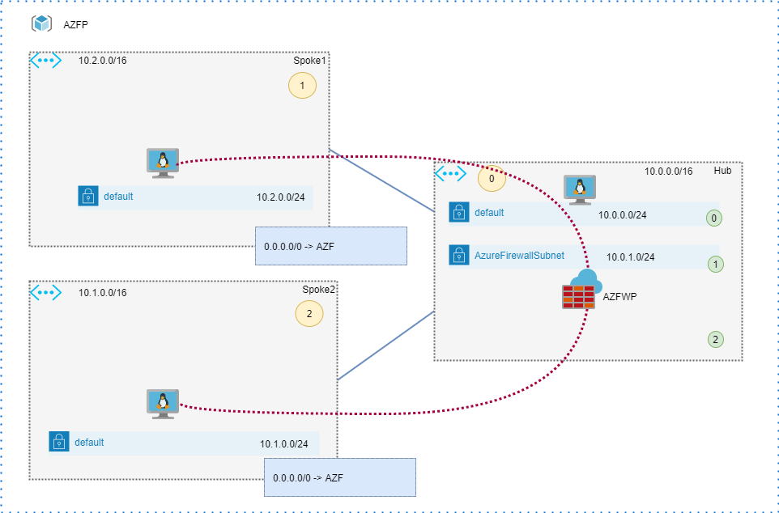

Topology gets deployed by running *terraform init/plan/apply* in the infrastructure folder. 

The basic configuration of the VM-300 is required. ( Interfaces, Virtual Router, Static Routes, Security zones ). The [reference configuration](supplementals/paloalto/candidate-config.xml) can be used from the supplemental folder. 

### Software flow generation
A basic approach to flow generation that any software developer would consider is to use the standard language libraries. In the example below, in the absence of scale and optimization, the usage of the "socket" library in Python could not handle 500k flows. The example is provided for educational purposes only. [Python 3.6](https://tecadmin.net/how-to-install-python-3-9-on-ubuntu-20-04) or later is required.

* [client.py](supplementals/python/client.py)
* [server.py](supplementals/python/server.py)

### Tools for benchmarking
[*wrk*](https://github.com/wg/wrk) is a modern HTTP benchmarking tool capable of generating significant load when run on a single multi-core CPU. It combines a multithreaded design with scalable event notification systems such as epoll and kqueue.
Typical wrk outpul looks like below
```bash
root@wrk:/# wrk -t12 -c400 -d30s http://10.1.0.4:80
Running 30s test @ http://10.1.0.4:80
  12 threads and 400 connections
  Thread Stats   Avg      Stdev     Max   +/- Stdev
    Latency    39.60ms   36.48ms 718.47ms   84.94%
    Req/Sec     0.95k   169.39     1.78k    69.22%
  340231 requests in 30.05s, 278.70MB read
Requests/sec:  11322.80
Transfer/sec:      9.28MB
```
In our scenario, WRK is not suited right out of the box, so we have to optimize it to meet our requirements. 

```bash
# wrk -c1024 -t128 -d300s http://10.1.0.4:80
unable to create thread 115: Too many open files

# wrk -c2024 -t16 -d300s http://10.1.0.4:80
unable to create thread 13: Too many open files
```
Due to the limit above it's time to use AKS for the purpose of spreading the load across multiple containers. To do so, we need to create a container with *wrk*, *nginx* and some networking tools built into it.
Container will be used as a source and the client in scenario 3.

```Docker
FROM ubuntu:20.04
RUN apt-get update -y
RUN apt-get install nginx -y
RUN apt-get install software-properties-common -y
RUN add-apt-repository -y "deb http://archive.ubuntu.com/ubuntu groovy universe"
RUN apt-get update -y
RUN apt-get install net-tools -y
RUN apt-get install iputils-ping -y
RUN apt-get install inetutils-traceroute -y
RUN apt-get install iproute2 -y
RUN apt-get install wrk -y
```
The docker container will be pushed to the ACR container registry.
```bash
az acr create -g $rg -n acrcopernic --sku Basic --admin-enabled
az acr login --name acrcopernic

docker build --network=host -t andrew/wrk .
docker tag andrew/wrk acrcopernic.azurecr.io/wrk
docker push acrcopernic.azurecr.io/wrk
```
You can run Docker from a user mode by adding your account to the group *docker*

```bash
sudo usermod -aG docker andrew
```

## Scenario 1. AKS to AKS via PaloAlto VM300

We will use wrk as a *deployment* on AKS1 in the following scenario. Wrk will target load balancer in front of NGINX deployed in AKS2. Traffic is routed to VM300 running in the hub and reflected back to the target in Spoke2.

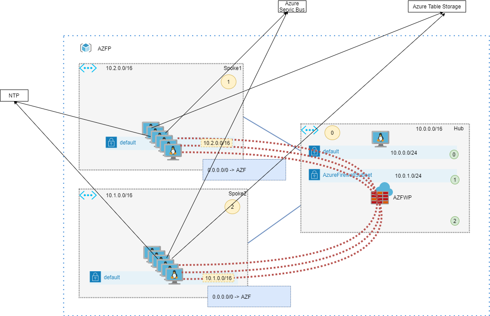

Getting rg and subnets variables from the *infrastructure* folder
```bash

rg=`terraform output rg | tr -d "\""`

subnet1=`terraform output subnet1_id | tr -d "\""`
subnet2=`terraform output subnet2_id | tr -d "\""`

vnet2_id=`terraform output vnet2_id | tr -d "\""`
```
Creating AKS1 ( deployed in *Spoke1* ) and getting credentials from it
```bash  
az aks create --resource-group "${rg}" --name aks1 --node-count 16 --enable-addons monitoring \
--generate-ssh-keys --vnet-subnet-id "${subnet1}" --service-cidr 172.16.0.0/24 --dns-service-ip 172.16.0.10 \
--network-plugin azure --attach-acr acrcopernic --enable-cluster-autoscaler --min-count 1 --max-count 100

az aks get-credentials --name aks1 --resource-group $rg

kubectl config get-contexts
kubectl config use-context aks1
```
Creating the deployment using wrk ACR image, instead of x.x.x.x use load balancer IP from the next step.
```bash
kubectl create deployment wrk --image=acrcopernic.azurecr.io/wrk:latest --replicas=240 -- bash -c "while true; do  wrk -t12 -c1200 -d3000s http://x.x.x.x:80 ; done "
```
Creating AKS2 ( deployed in Spoke2 ) and getting credentials from it
```bash
az aks create --resource-group "${rg}" --name aks2 --node-count 3 --enable-addons monitoring \
--generate-ssh-keys --vnet-subnet-id "${subnet2}" --service-cidr 172.16.0.0/24 --dns-service-ip 172.16.0.10 \
--network-plugin azure --attach-acr acrcopernic --enable-cluster-autoscaler --min-count 1 --max-count 100

az aks get-credentials --name aks2 --resource-group $rg
kubectl config get-contexts
kubectl config use-context aks2
```
Role creation is necessery. [More here](https://github.com/MicrosoftLearning/AZ500-AzureSecurityTechnologies/issues/113)
```
aks_managed_id=$(az aks show --name aks2 --resource-group $rg --query identity.principalId -o tsv)
az role assignment create --assignee $aks_managed_id --role "Contributor" --scope $vnet2_id
```
Creating nginx deployment and exposing it via internal load balancer. Use [aks2-lb.yaml](supplementals/aks/aks2-lb.yaml) as a template.
```bash
kubectl create deployment nginx --replicas=80 --image=nginx

kubectl apply -f aks2-lb.yaml 
```
Look over following output to get an ip `10.1.0.129` of the lb.
```bash
kubectl get svc
NAME         TYPE           CLUSTER-IP     EXTERNAL-IP   PORT(S)        AGE
kubernetes   ClusterIP      172.16.0.1     <none>        443/TCP        47h    
nginx        LoadBalancer   172.16.0.103   10.1.0.129    80:30074/TCP   47h  
```
at this point traffic should start to flow. By looking at the `monitor` of PaloAlto VM we can count the total incoming and outbound flows. Its clearly far from 500 000 and stabilized around 170 000 in each direction.
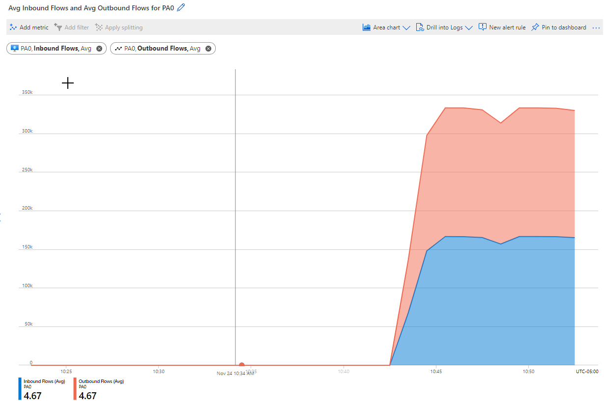 Changing the number of pods or cluster nodes or the number of pods has no effect on that number. 

## Scenario 2. AKS to AKS via Linux Router

In the previous scenario, the total number of inbound and outbound flows is approximately 32% lower than that of the platform (320000 versus 500000). This problem may be related to Palo Alto VM size (D3_v2) or software limitations. As per the [specsheet](https://media.paloaltonetworks.com/documents/specsheet-vm-series-specsheet.pdf), VM-300 can handle 250000 sessions. 
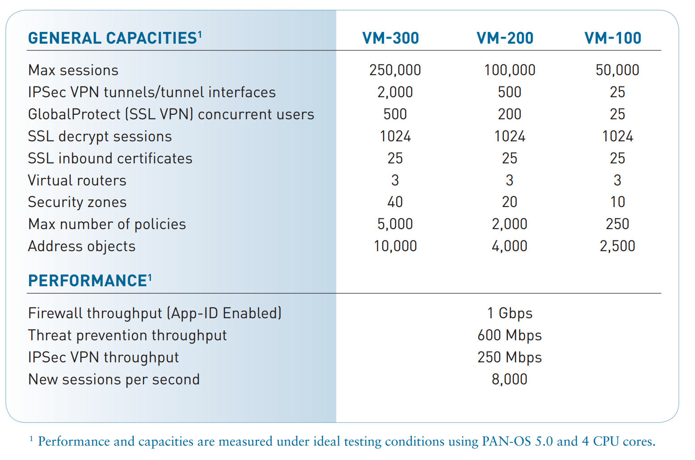
Let's determine how a standard Linux D3_v2 and DS4_v2 router performs. There are only two commands required to perform basic packet forwarding. `sysctl -w net.ipv4.ip_forward=1` and `sysctl -p` . 
For more implementation details, please refer to [linux_router.tf](infrastructure/linux_router.tf). 

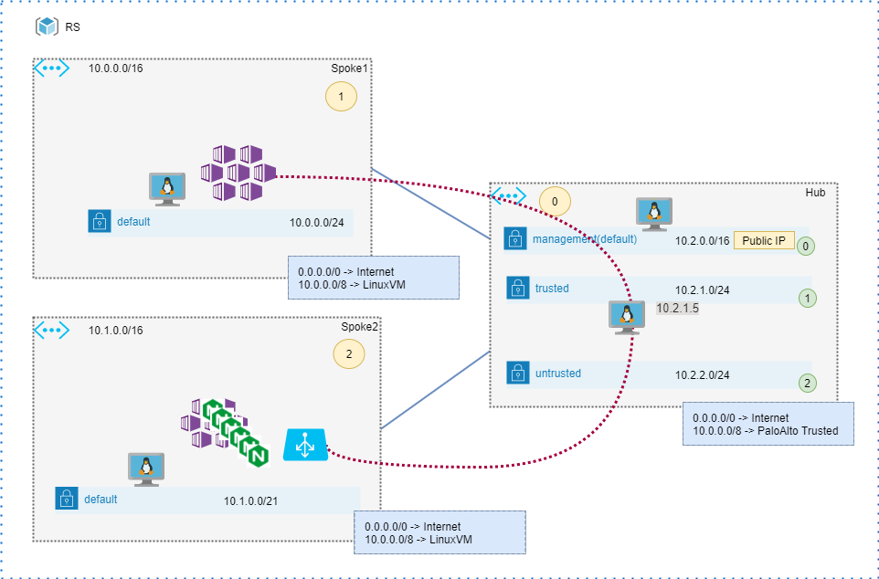

Update the routing table in route_table.tf with the updated NH and re-run Terraform apply. 
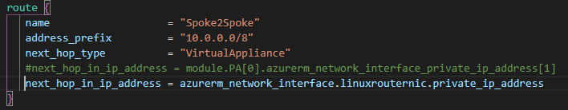

Ensure that target IP in wrk deployment on AKS1 match the service private IP of the AKS2.
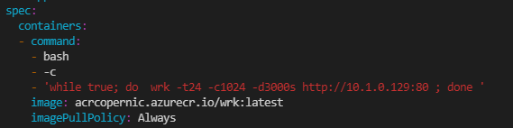

Linux Routers clearly outperform Palo Alto Routers in terms of performance. A total amount of flows has been created that is even bigger than the maximum number that is allowed by the platform. 

### [DS4_v2](https://docs.microsoft.com/en-us/azure/virtual-machines/dv2-dsv2-series) flow performance:

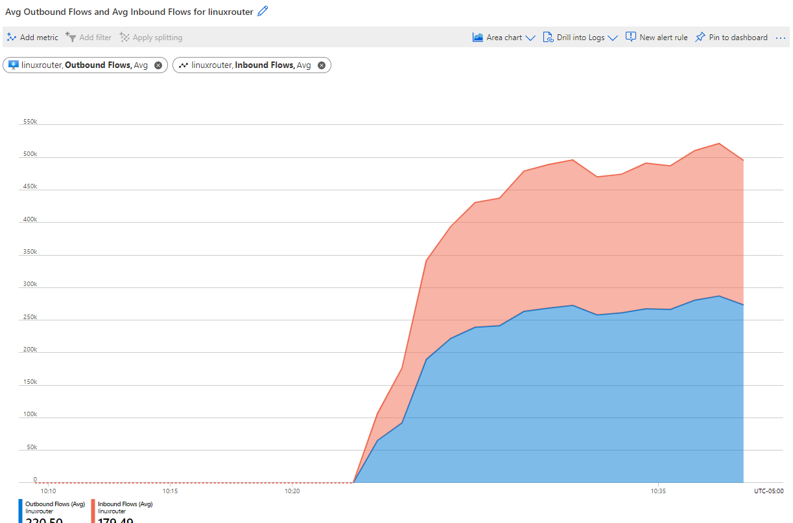

### [D3_v2](https://docs.microsoft.com/en-us/azure/virtual-machines/dv2-dsv2-series) flow performance:

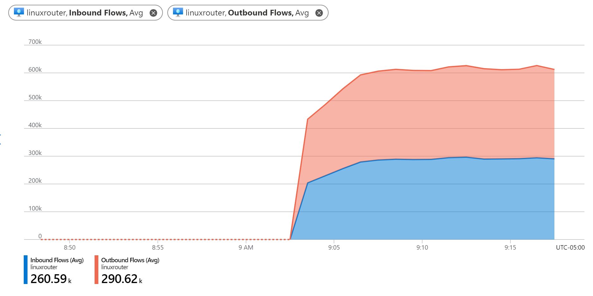

## Scenario 3. AKS to AKS via Azure Firewall.

TBD. Cannot get a flow information directly from the firewall. 

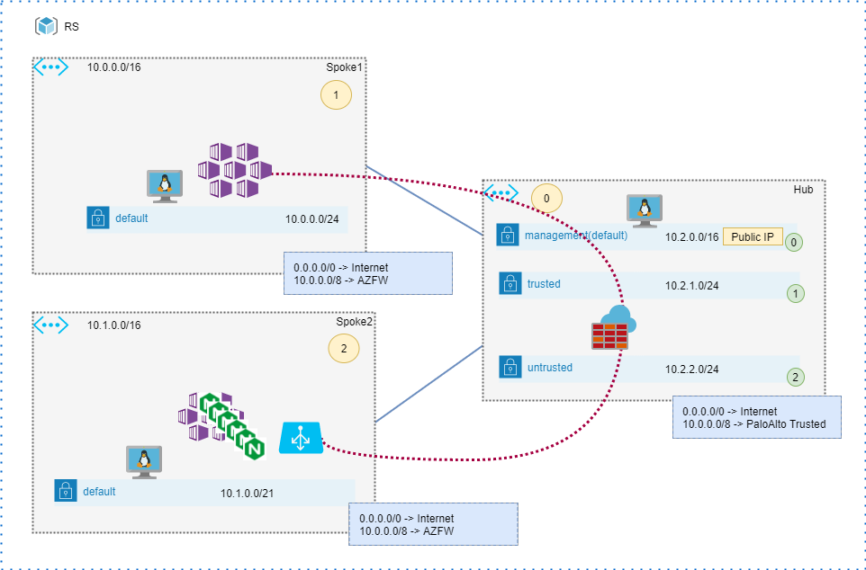

Update the routing table in route_table.tf with the updated NH and re-run Terraform apply. 
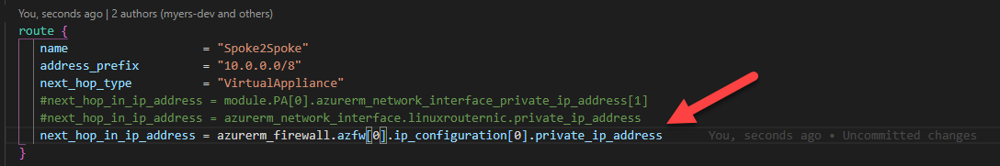

## Scenario 4. AKS to NGINX

In the final scenario, we will try to exhaust all ports on the DS4 node using NGINX. 

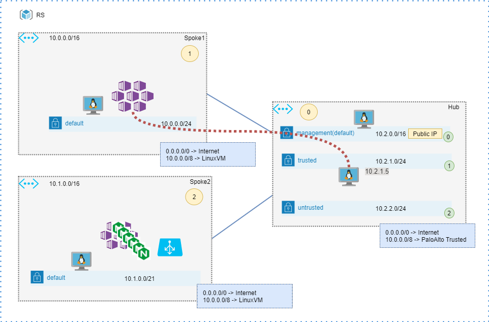


```bash
ip=`terraform output linux_router_private_ip | tr -d "\""`
kubectl delete deploy/wrk
kubectl create deployment wrk --image=acrcopernic.azurecr.io/wrk:latest --replicas=240 -- bash -c "while true; do  wrk -t12 -c1200 -d3000s http://$ip:80 ; done "
```

The amount of flows are almost equal to the maximum allowed by platform.

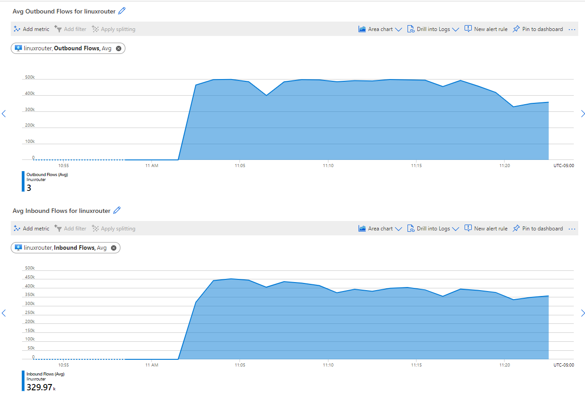