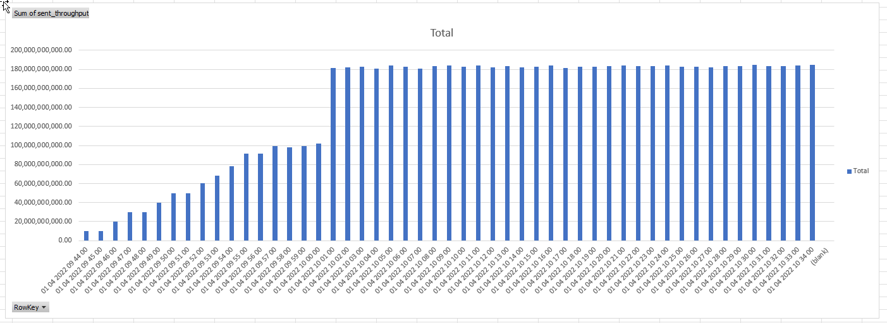

# Azure Fierewall premium throughput testing

## Overview

The topology for the throughput testing is shown below. This is a classic hub-and-spoke topology with a deployment of Azure Firewall Premium in the hub. 
Deployment code ( terraform ) is in [this](infrastructure/) folder.


There were two VM sizes tested: DS4_v2 and DS5_v2, which offer [performance](https://docs.microsoft.com/en-us/azure/virtual-machines/dv2-dsv2-series) of 6 and 12Gbps respectively.


## iperf3 tests  - Azure Firewall Premium , AFWEnableAccelnet = False 

### iperf3 spoke1 to spoke2 ( no tunneling )

One Flow (DS4_v2 with AN)
```
azureadmin@spoke1-vm:~$ iperf3 -c 10.1.0.4
Connecting to host 10.1.0.4, port 5201
[  4] local 10.2.0.4 port 45070 connected to 10.1.0.4 port 5201
  
- - - - - - - - - - - - - - - - - - - - - - - - -
[ ID] Interval           Transfer     Bandwidth       Retr
[  4]   0.00-10.00  sec  2.30 GBytes  1.98 Gbits/sec  385             sender
[  4]   0.00-10.00  sec  2.30 GBytes  1.97 Gbits/sec                  receiver
```

64 parallel flows (-P64): (DS4_v2 with AN)
```

[SUM]   0.00-10.00  sec  6.50 GBytes  5.58 Gbits/sec    6             sender
[SUM]   0.00-10.00  sec  6.44 GBytes  5.53 Gbits/sec                  receiver

```
### iperf3 spoke1 to hub (bypassing firewall)

One Flow (DS4_v2 with AN) - close to the target performance
```
azureadmin@spoke1-vm:~$ iperf3 -c 10.0.1.4
Connecting to host 10.0.1.4, port 5201
[  4] local 10.2.0.4 port 53928 connected to 10.0.1.4 port 5201
[ ID] Interval           Transfer     Bandwidth       Retr  Cwnd   
- - - - - - - - - - - - - - - - - - - - - - - - -
[ ID] Interval           Transfer     Bandwidth       Retr
[  4]   0.00-10.00  sec  6.66 GBytes  5.72 Gbits/sec    0             sender
[  4]   0.00-10.00  sec  6.65 GBytes  5.72 Gbits/sec                  receiver

iperf Done.
```
64 parallel flows (-P64): (DS4_v2 with AN)

```
[SUM]   0.00-10.00  sec  6.73 GBytes  5.78 Gbits/sec    0             sender
[SUM]   0.00-10.00  sec  6.66 GBytes  5.72 Gbits/sec                  receiver
```
## Combining flows with vxlan encapsulation

The best way to combine multiple flows is to wrap them with Vxlan encapsulation: (IPIP and GRE are not permitted in Azure)

```
# spoke1
ip link add vxlan1 type vxlan id 1 remote 10.1.0.4 dstport 4789 dev eth0
ip link set vxlan1 up
ip addr add 10.77.0.1/30 dev vxlan1

# spoke2

ip link add vxlan1 type vxlan id 1 remote 10.2.0.4 dstport 4789 dev eth0
ip link set vxlan1 up
ip addr add 10.77.0.2/30 dev vxlan1
```

```
# spoke to spoke over VXLAN : 64 flows DS4_v2 with AN

root@spoke1-vm:~# iperf3 -P 64 -c 10.77.0.2
[SUM]   0.00-10.00  sec  2.89 GBytes  2.48 Gbits/sec  214             sender
[SUM]   0.00-10.00  sec  2.77 GBytes  2.38 Gbits/sec                  receiver

root@spoke1-vm:~# iperf3 -P 128 -c 10.77.0.2
[SUM]   0.00-10.00  sec  2.92 GBytes  2.51 Gbits/sec  1144             sender
[SUM]   0.00-10.00  sec  2.78 GBytes  2.39 Gbits/sec                  receiver
```

``` 
#spoke to spoke over VXLAN : 64 flows : DS5_v2 with AN
[SUM]   0.00-10.00  sec  2.17 GBytes  1.87 Gbits/sec  500             sender
[SUM]   0.00-10.00  sec  2.03 GBytes  1.74 Gbits/sec                  receiver

[SUM]   0.00-10.00  sec  2.26 GBytes  1.94 Gbits/sec  1814             sender
[SUM]   0.00-10.00  sec  2.13 GBytes  1.83 Gbits/sec                  receiver
```

## Register AFWEnableAccelnet feature

```
Select-AzSubscription -Subscription ACAI_Network_Internal_1

Register-AzProviderFeature -Featurename AFWEnableAccelnet  -ProviderNamespace Microsoft.Network

PS C:\Users> Get-AzProviderFeature -ProviderNamespace Microsoft.Network -FeatureName AFWEnableAccelnet

FeatureName       ProviderName      RegistrationState
-----------       ------------      -----------------
AFWEnableAccelnet Microsoft.Network Registered

```

Re-testing with VXLAN encapsulation. Spoke to Spoke :

```
# spoke to spoke over VXLAN : 64 flows DS5_v2 with AN

[SUM]   0.00-10.00  sec  6.07 GBytes  5.21 Gbits/sec  2868             sender
[SUM]   0.00-10.00  sec  5.94 GBytes  5.10 Gbits/sec                  receiver

[SUM]   0.00-10.00  sec  5.70 GBytes  4.90 Gbits/sec  496             sender
[SUM]   0.00-10.00  sec  5.60 GBytes  4.81 Gbits/sec                  receiver

[SUM]   0.00-10.00  sec  5.39 GBytes  4.63 Gbits/sec   38             sender
[SUM]   0.00-10.00  sec  5.30 GBytes  4.55 Gbits/sec                  receiver


# spoke to spoke over VXLAN : 64 flows DS4_v2 with AN

[SUM]   0.00-10.00  sec  5.70 GBytes  4.90 Gbits/sec  496             sender
[SUM]   0.00-10.00  sec  5.60 GBytes  4.81 Gbits/sec                  receiver

[SUM]   0.00-10.00  sec  6.64 GBytes  5.71 Gbits/sec  4840             sender
[SUM]   0.00-10.00  sec  6.61 GBytes  5.68 Gbits/sec                  receiver

[SUM]   0.00-10.00  sec  6.64 GBytes  5.71 Gbits/sec  4840             sender
[SUM]   0.00-10.00  sec  6.61 GBytes  5.68 Gbits/sec                  receiver


```

Throughput between hub and spoke directly (bypassing Firewall) over VXLAN.


Configuration

```
# spoke1
ip link add vxlan2 type vxlan id 2 remote 10.0.1.4 dstport 4789 dev eth0
ip link set vxlan2 up
ip addr add 10.78.0.1/30 dev vxlan2

# hub

ip link add vxlan2 type vxlan id 2 remote 10.2.0.4 dstport 4789 dev eth0
ip link set vxlan2 up
ip addr add 10.78.0.2/30 dev vxlan2
```

Results

```
on DS4_v2 with AN spoke to hub , bypassing firewall . vxlan 1 to vxlan 2 , 64 flows

[SUM]   0.00-10.00  sec  6.52 GBytes  5.60 Gbits/sec    0             sender
[SUM]   0.00-10.00  sec  6.44 GBytes  5.53 Gbits/sec                  receiver

```

## Test based on Standard_D48_v3


| Test Case  | VM size | Src | Dst | Encap | Proto | Flows | Performance | Note |
|-----------|---------|--------|-------------|---------------|----------|       :-:       |     :-:     |  :-: |
| 1. One flow iperf3 spoke to spoke | Standard_D48_v3 [24 Mbps](https://docs.microsoft.com/en-us/azure/virtual-machines/dv3-dsv3-series) | spoke1 (10.2.0.4) | spoke2 (10.1.0.4) | native | iperf3 | 1 | 9.33 Gbits/sec | [linky](#test-case-1---iperf3-one-flow)
| 2. 64 flows iperf3 spoke to spoke | Standard_D48_v3 [24 Mbps](https://docs.microsoft.com/en-us/azure/virtual-machines/dv3-dsv3-series) | spoke1 (10.2.0.4) | spoke2 (10.1.0.4) | native | iperf3 | 64 | 13.9 - 9.55 Gbit/sec| [linky](#test-case-2---64-flows-iperf3-spoke-to-spoke)
| 3. One flow iperf3 spoke to spoke encapsulated to VXLAN | Standard_D48_v3 [24 Mbps](https://docs.microsoft.com/en-us/azure/virtual-machines/dv3-dsv3-series) | spoke1 (10.77.0.1) | spoke2 (10.77.0.2) | VXLAN | iperf3 | 1 | 1.33 Gbits/sec | [linky](#test-case-3---one-flow-spoke-to-spoke-iperf3-encapsulated-to-vxlan)
| 4. 64 flows iperf3 spoke to spoke encapsulated to VXLAN | Standard_D48_v3 [24 Mbps](https://docs.microsoft.com/en-us/azure/virtual-machines/dv3-dsv3-series) | spoke1 (10.77.0.1) | spoke2 (10.77.0.2) | VXLAN | iperf3 | 64 | 11.6 Gbits/sec | [linky](#test-case-4---64-flows-spoke-to-spoke-iperf3-encapsulated-to-vxlan)
| 5. One flow ftp spoke to spoke | Standard_D48_v3 [24 Mbps](https://docs.microsoft.com/en-us/azure/virtual-machines/dv3-dsv3-series) | spoke1 (10.2.0.4) | spoke2 (10.1.0.4) | native | ftp | 1 | 310.38 MB/s = 2480 Mbps | [linky](#test-case-5---one-flow-spoke-to-spoke-ftp)
| 6. 64 flows lftp spoke to spoke encapsulated to VXLAN | Standard_D48_v3 [24 Mbps](https://docs.microsoft.com/en-us/azure/virtual-machines/dv3-dsv3-series) | spoke1 (10.77.0.1) | spoke2 (10.77.0.2) | VXLAN | lftp | 64 | 300 MiB/sec = 2516 Mbps| [linky](#test-case-6---64-flows-spoke-to-spoke-lftp-encapsulated-to-vxlan)
| 7. One flow iperf3 spoke to spoke | Standard_DS5_v2 [12 Mbps](https://docs.microsoft.com/en-us/azure/virtual-machines/dv2-dsv2-series) | spoke1 (10.2.0.4) | spoke2 (10.1.0.4) | native | iperf3 | 1 | 9.42 Gbps/s | [linky](#test-case-7-one-flow-iperf3-spoke-to-spoke)
| 8. 64 flows iperf3 spoke to spoke | Standard_DS5_v2 [12 Mbps](https://docs.microsoft.com/en-us/azure/virtual-machines/dv2-dsv2-series) | spoke1 (10.2.0.4) | spoke2 (10.1.0.4) | native | iperf3 | 64 | 10.9 Gbps/s| [linky](#test-case-8-64-flows-iperf3-spoke-to-spoke)
| 9. One flow iperf3 spoke to spoke encapsulated to VXLAN |Standard_DS5_v2 [12 Mbps](https://docs.microsoft.com/en-us/azure/virtual-machines/dv2-dsv2-series)| spoke1 (10.77.0.1) | spoke2 (10.77.0.2) | VXLAN | iperf3 | 1 | 1.37 Gbps/s | [linky](#test-case-9-one-flow-iperf3-spoke-to-spoke-encapsulated-to-vxlan)
| 10. 64 flows iperf3 spoke to spoke encapsulated to VXLAN | Standard_DS5_v2 [12 Mbps](https://docs.microsoft.com/en-us/azure/virtual-machines/dv2-dsv2-series) | spoke1 (10.77.0.1) | spoke2 (10.77.0.2) | VXLAN | iperf3 | 64 | 10.7 Gbps/s | [linky](#test-case-10-64-flows-iperf3-spoke-to-spoke-encapsulated-to-vxlan)

### Test case 1 - One flow iperf3 spoke to spoke

spoke1 
```
iperf3 -c 10.1.0.4

[ ID] Interval           Transfer     Bandwidth       Retr
[  4]   0.00-10.00  sec  10.9 GBytes  9.33 Gbits/sec  1208             sender
[  4]   0.00-10.00  sec  10.9 GBytes  9.33 Gbits/sec                  receiver

[  4]   0.00-10.00  sec  11.0 GBytes  9.42 Gbits/sec  621             sender
[  4]   0.00-10.00  sec  11.0 GBytes  9.42 Gbits/sec                  receiver
```
spoke2 
```
iperf3 -s
```

### Test case 2 - 64 flows iperf3 spoke to spoke

spoke1 
```
iperf3 -c 10.1.0.4 -P 64

[SUM]   0.00-10.00  sec  16.2 GBytes  13.9 Gbits/sec  6198             sender
[SUM]   0.00-10.00  sec  16.1 GBytes  13.8 Gbits/sec                  receiver

[SUM]   0.00-10.00  sec  11.1 GBytes  9.55 Gbits/sec  10512             sender
[SUM]   0.00-10.00  sec  11.0 GBytes  9.46 Gbits/sec                  receiver

[SUM]   0.00-10.00  sec  11.1 GBytes  9.53 Gbits/sec  17613             sender
[SUM]   0.00-10.00  sec  11.0 GBytes  9.47 Gbits/sec                  receiver

```
spoke2 
```
iperf3 -s
```

### Test case 3 - One flow spoke to spoke iperf3 encapsulated to VXLAN
spoke1 
```
ip link add vxlan1 type vxlan id 1 remote 10.1.0.4 dstport 4789 dev eth0
ip link set vxlan1 up
ip addr add 10.77.0.1/30 dev vxlan1

iperf3 -c 10.77.0.2

[ ID] Interval           Transfer     Bandwidth       Retr
[  4]   0.00-10.00  sec  1.25 GBytes  1.08 Gbits/sec   62             sender
[  4]   0.00-10.00  sec  1.25 GBytes  1.08 Gbits/sec                  receiver

[ ID] Interval           Transfer     Bandwidth       Retr
[  4]   0.00-10.00  sec  1.55 GBytes  1.33 Gbits/sec   90             sender
[  4]   0.00-10.00  sec  1.55 GBytes  1.33 Gbits/sec                  receiver
```


spoke2
```
ip link add vxlan1 type vxlan id 1 remote 10.2.0.4 dstport 4789 dev eth0
ip link set vxlan1 up
ip addr add 10.77.0.2/30 dev vxlan1

iperf3 -s -i vxlan1
```

### Test case 4 - 64 flows spoke to spoke iperf3 encapsulated to VXLAN
spoke1 
```
ip link add vxlan1 type vxlan id 1 remote 10.1.0.4 dstport 4789 dev eth0
ip link set vxlan1 up
ip addr add 10.77.0.1/30 dev vxlan1

iperf3 -c 10.77.0.2 -P64

[SUM]   0.00-10.04  sec  11.0 GBytes  9.38 Gbits/sec  5267             sender
[SUM]   0.00-10.04  sec  10.9 GBytes  9.35 Gbits/sec                  receiver

[SUM]   0.00-10.00  sec  8.25 GBytes  7.08 Gbits/sec  1747             sender
[SUM]   0.00-10.00  sec  8.25 GBytes  7.08 Gbits/sec                  receiver

[SUM]   0.00-10.03  sec  13.5 GBytes  11.6 Gbits/sec  4488             sender
[SUM]   0.00-10.03  sec  13.3 GBytes  11.4 Gbits/sec                  receiver
```

spoke2
```
ip link add vxlan1 type vxlan id 1 remote 10.2.0.4 dstport 4789 dev eth0
ip link set vxlan1 up
ip addr add 10.77.0.2/30 dev vxlan1

iperf3 -s -i vxlan1
```

### Test case 5 - One flow spoke to spoke ftp 
spoke1
```
apt-get install ncftp

ncftp / > get 10gb-file
10gb-file:                                               9.31 GB  103.35 MB/s 
ncftp / > get 10gb-file
10gb-file:                                               9.31 GB  310.38 MB/s
```
spoke2
```
apt-get install proftpd
# enable anonymous access ( /etc/proftpd/proftpd.conf )
cd /srv/ftp 
dd if=/dev/urandom of=10gb-file bs=1000000000 count=10 iflag=fullblock # takes about 2-3 min
#    root@spoke2-vm:/srv/ftp# ls -lah
#    total 9.4G
#    drwxr-xr-x 2 ftp  nogroup 4.0K Dec 22 14:04 .
#    drwxr-xr-x 3 root root    4.0K Dec 22 13:50 ..
#    -rw-r--r-- 1 root root    9.4G Dec 22 14:08 10gb-file
#    -rw-r--r-- 1 root root     170 Mar 12  2018 welcome.msg
```

### Test case 6 - 64 flows spoke to spoke lftp encapsulated to VXLAN

spoke1
```
lftp -e 'pget -n 64 ftp://10.77.0.2/10gb-file;quit'

10000000000 bytes transferred in 31 seconds (305.19 MiB/s)

```

spoke2

### Test case 7. One flow iperf3 spoke to spoke 
```
- - - - - - - - - - - - - - - - - - - - - - - - -
[ ID] Interval           Transfer     Bandwidth       Retr
[  4]   0.00-10.00  sec  10.8 GBytes  9.30 Gbits/sec  2487             sender
[  4]   0.00-10.00  sec  10.8 GBytes  9.29 Gbits/sec                  receiver

[ ID] Interval           Transfer     Bandwidth       Retr
[  4]   0.00-10.00  sec  11.0 GBytes  9.42 Gbits/sec  1410             sender
[  4]   0.00-10.00  sec  11.0 GBytes  9.41 Gbits/sec                  receiver
```
### Test case 8. 64 flows iperf3 spoke to spoke 

```
[SUM]   0.00-10.00  sec  12.7 GBytes  10.9 Gbits/sec  13621             sender
[SUM]   0.00-10.00  sec  12.6 GBytes  10.9 Gbits/sec                  receiver

[SUM]   0.00-10.00  sec  12.7 GBytes  10.9 Gbits/sec  6427             sender
[SUM]   0.00-10.00  sec  12.7 GBytes  10.9 Gbits/sec                  receiver
```

### Test case 9. One flow iperf3 spoke to spoke encapsulated to VXLAN 
```
[ ID] Interval           Transfer     Bandwidth       Retr
[  4]   0.00-10.00  sec  1.59 GBytes  1.37 Gbits/sec   84             sender
[  4]   0.00-10.00  sec  1.59 GBytes  1.37 Gbits/sec                  receiver

[ ID] Interval           Transfer     Bandwidth       Retr
[  4]   0.00-10.00  sec  1.59 GBytes  1.37 Gbits/sec   84             sender
[  4]   0.00-10.00  sec  1.59 GBytes  1.37 Gbits/sec                  receiver
### Test case 10. 64 flows iperf3 spoke to spoke encapsulated to VXLAN 

[SUM]   0.00-10.00  sec  12.5 GBytes  10.7 Gbits/sec  17549             sender
[SUM]   0.00-10.00  sec  12.4 GBytes  10.6 Gbits/sec                  receiver
```

## Combined throughput on max-pre-scaled Firewall Premium. 

The following three methods were used in order to verify the performance of the Firewall Premium prescaling to 20 instances:

1. iperf3 30 sec, short-duration flows in VMSS , combined over 30 instances
2. iperf3 280 sec , longer-duration flows, with 64x multiplier , combined over 30 instances. Compared with AZFW Throughput Metrics
3. iperf3 29 min (1740 sec) , jumbo flows, with 64x multiplier , combined over 30 instances. Compared with AZFW Throughput Metrics

All three methods above provide an average 180Gbps performance with unsignificant devaiation. 

Topology below were used for test:


Notes about implementation:

1. Client/Server architecture were used
2. Clients/Servers were implemented as VMSS
3. Clients and Servers are NTP-synchronized
4. Azure Service Bus queue were used for feeding client pool with server IP addresses 
5. Azure Table Store used for statistics collection
6. VMSS were built based on [Standard_D4_v4](https://docs.microsoft.com/en-us/azure/virtual-machines/dv4-dsv4-series) ( 4 cores, 10Gbps network performance ) 
7. 30 instances should be enough to cover potential max of the AZFW ( 20 * 10Gbps < 30 * 10Gbps)

### iperf3 30 sec, short-duration flows in VMSS , combined over 30 instances

[Statistics collected from 30 clients](supplementals/stats/stats-30sec-30instances.xlsx)

Visualization ( aggregate ):




### iperf3 280 sec , longer-duration flows, with 64x multiplier , combined over 30 instances. Compared with AZFW Throughput Metrics

[Statistics collected from 30 clients](supplementals/stats/stats-280sec-30instances.xlsx)

Visualization ( aggregate ), Note the throughput is symmetrical


Metrics ( AZFW Throughput )


### iperf3 29 min (1740 sec) , jumbo flows, with 64x multiplier , combined over 30 instances. Compared with AZFW Throughput Metrics

[Statistics collected from 30 clients](supplementals/stats/stats-1740sec-30instances.xlsx)

Visualization ( aggregate ), Note the throughput is symmetrical


## Comparison of performance with IDPS (Alert + Deny) vs IDPS off

When Azure Firewall Premium configured with Single Network Policy and IDPS is enabled in Alert and Deny mode it has significant impact on transit traffic performance. 

Here is an example of iperf3 test with 64 flows

| IDPS |# of instances| Iperf3 -P64 |Source/Destination VM size| 
|------|-------------|--------------------------|--------|
|Disabled|10|92.1 Gbits/sec|Standard_D4_v4||
|Alert and Deny|10|8.6G bits/sec|Standard_D4_v4|


## Comparsion of RTT with IDPS ( Alert + Deny ) vs IDPS off

Azure Firewall Premium configured with Single Network Policy and IDPS configured in Alert and Deny mode significantly impacts transit RTT. 

As an example, here is an iperf3 test of 64 flows (combined data). The top graph displays the throughput while the bottom graph displays the RTT data. This is a relative data. 


[Metrics](supplementals/stats/IDPS-network-delay-stats.xlsx)

## RTT measurements in iperf3

As per [esnet/iperf](https://github.com/esnet/iperf/commit/432ef7ebb3abfedcb87b717b251eb72fc1a2d0c3) :

>Retrieve RTT information on platforms supporting it.
This value is available on the sender side, expressed in
microseconds.  It's available in the JSON output.

>In the JSON output we also output the maximum observed RTT
per-stream.  Note that since the observation interval is many times
the RTT, it's not clear how good this value would be at capturing the
largest computed RTT value over the lifetime of each stream.

>While here, also determine the maximum observed snd_cwnd value over
the lifetime of each stream.

>This all works pretty well on Linux, but on FreeBSD (which should
theoretically be supported) we don't do a good job of supporting the
tcp_info structure.  We need to make this code a lot more portable,
rather than just assuming the world of platforms is "Linux"
vs. "everything else".  Fixing this requires some rearchitecting of
the way that we retrieve, compute, and print statistics.

RTT returned in [usec](https://github.com/esnet/iperf/blob/332c31ee6512514c216077407a725b5b958b1582/src/tcp_info.c#L168)
