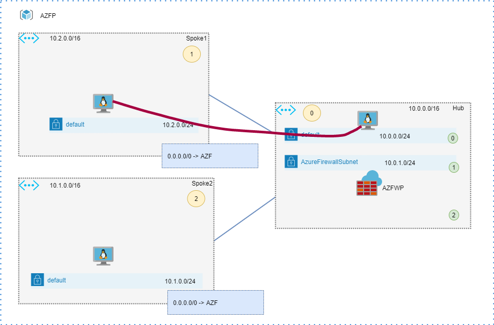

# Azure Fierewall premium throughput testing

## Overview

The topology for the throughput testing is shown below. This is a classic hub-and-spoke topology with a deployment of Azure Firewall Premium in the hub. 
Deployment code ( terraform ) is in [this](infrastructure/) folder.


There were two VM sizes tested: DS4_v2 and DS5_v2, which offer [performance](https://docs.microsoft.com/en-us/azure/virtual-machines/dv2-dsv2-series) of 6 and 12Gbps respectively.


## iperf3 tests  - Azure Firewall Premium , AFWEnableAccelnet = False 

### iperf3 spoke1 to spoke2 ( no tunneling )

One Flow (DS4_v2 with AN)
```
azureadmin@spoke1-vm:~$ iperf3 -c 10.1.0.4
Connecting to host 10.1.0.4, port 5201
[  4] local 10.2.0.4 port 45070 connected to 10.1.0.4 port 5201
  
- - - - - - - - - - - - - - - - - - - - - - - - -
[ ID] Interval           Transfer     Bandwidth       Retr
[  4]   0.00-10.00  sec  2.30 GBytes  1.98 Gbits/sec  385             sender
[  4]   0.00-10.00  sec  2.30 GBytes  1.97 Gbits/sec                  receiver
```

64 parallel flows (-P64): (DS4_v2 with AN)
```

[SUM]   0.00-10.00  sec  6.50 GBytes  5.58 Gbits/sec    6             sender
[SUM]   0.00-10.00  sec  6.44 GBytes  5.53 Gbits/sec                  receiver

```
### iperf3 spoke1 to hub (bypassing firewall)

One Flow (DS4_v2 with AN) - close to the target performance
```
azureadmin@spoke1-vm:~$ iperf3 -c 10.0.1.4
Connecting to host 10.0.1.4, port 5201
[  4] local 10.2.0.4 port 53928 connected to 10.0.1.4 port 5201
[ ID] Interval           Transfer     Bandwidth       Retr  Cwnd   
- - - - - - - - - - - - - - - - - - - - - - - - -
[ ID] Interval           Transfer     Bandwidth       Retr
[  4]   0.00-10.00  sec  6.66 GBytes  5.72 Gbits/sec    0             sender
[  4]   0.00-10.00  sec  6.65 GBytes  5.72 Gbits/sec                  receiver

iperf Done.
```
64 parallel flows (-P64): (DS4_v2 with AN)

```
[SUM]   0.00-10.00  sec  6.73 GBytes  5.78 Gbits/sec    0             sender
[SUM]   0.00-10.00  sec  6.66 GBytes  5.72 Gbits/sec                  receiver
```
## Combining flows with vxlan encapsulation

The best way to combine multiple flows is to wrap them with Vxlan encapsulation: (IPIP and GRE are not permitted in Azure)

```
# spoke1
ip link add vxlan1 type vxlan id 1 remote 10.1.0.4 dstport 4789 dev eth0
ip link set vxlan1 up
ip addr add 10.77.0.1/30 dev vxlan1

# spoke2

ip link add vxlan1 type vxlan id 1 remote 10.2.0.4 dstport 4789 dev eth0
ip link set vxlan1 up
ip addr add 10.77.0.2/30 dev vxlan1
```

```
# spoke to spoke over VXLAN : 64 flows DS4_v2 with AN

root@spoke1-vm:~# iperf3 -P 64 -c 10.77.0.2
[SUM]   0.00-10.00  sec  2.89 GBytes  2.48 Gbits/sec  214             sender
[SUM]   0.00-10.00  sec  2.77 GBytes  2.38 Gbits/sec                  receiver

root@spoke1-vm:~# iperf3 -P 128 -c 10.77.0.2
[SUM]   0.00-10.00  sec  2.92 GBytes  2.51 Gbits/sec  1144             sender
[SUM]   0.00-10.00  sec  2.78 GBytes  2.39 Gbits/sec                  receiver
```

``` 
#spoke to spoke over VXLAN : 64 flows : DS5_v2 with AN
[SUM]   0.00-10.00  sec  2.17 GBytes  1.87 Gbits/sec  500             sender
[SUM]   0.00-10.00  sec  2.03 GBytes  1.74 Gbits/sec                  receiver

[SUM]   0.00-10.00  sec  2.26 GBytes  1.94 Gbits/sec  1814             sender
[SUM]   0.00-10.00  sec  2.13 GBytes  1.83 Gbits/sec                  receiver
```

## Register AFWEnableAccelnet feature

```
Select-AzSubscription -Subscription ACAI_Network_Internal_1

Register-AzProviderFeature -Featurename AFWEnableAccelnet  -ProviderNamespace Microsoft.Network

PS C:\Users> Get-AzProviderFeature -ProviderNamespace Microsoft.Network -FeatureName AFWEnableAccelnet

FeatureName       ProviderName      RegistrationState
-----------       ------------      -----------------
AFWEnableAccelnet Microsoft.Network Registered

```

Re-testing with VXLAN encapsulation. Spoke to Spoke :

```
# spoke to spoke over VXLAN : 64 flows DS5_v2 with AN

[SUM]   0.00-10.00  sec  2.17 GBytes  1.86 Gbits/sec  962             sender
[SUM]   0.00-10.00  sec  2.02 GBytes  1.74 Gbits/sec                  receiver

[SUM]   0.00-10.00  sec  2.17 GBytes  1.86 Gbits/sec  962             sender
[SUM]   0.00-10.00  sec  2.02 GBytes  1.74 Gbits/sec                  receiver

[SUM]   0.00-10.00  sec  2.17 GBytes  1.86 Gbits/sec  962             sender
[SUM]   0.00-10.00  sec  2.02 GBytes  1.74 Gbits/sec                  receiver

# spoke to spoke over VXLAN : 64 flows DS4_v2 with AN

[SUM]   0.00-10.00  sec  2.57 GBytes  2.21 Gbits/sec  718             sender
[SUM]   0.00-10.00  sec  2.45 GBytes  2.11 Gbits/sec                  receiver

[SUM]   0.00-10.00  sec  2.68 GBytes  2.31 Gbits/sec  3735             sender
[SUM]   0.00-10.00  sec  2.57 GBytes  2.21 Gbits/sec                  receiver

```

Throughput between hub and spoke directly (bypassing Firewall) over VXLAN.




Configuration

```
# spoke1
ip link add vxlan2 type vxlan id 2 remote 10.0.1.4 dstport 4789 dev eth0
ip link set vxlan2 up
ip addr add 10.78.0.1/30 dev vxlan2

# hub

ip link add vxlan2 type vxlan id 2 remote 10.2.0.4 dstport 4789 dev eth0
ip link set vxlan2 up
ip addr add 10.78.0.2/30 dev vxlan2
```

Results

```
on DS4_v2 with AN spoke to hub , bypassing firewall . vxlan 1 to vxlan 2 , 64 flows

[SUM]   0.00-10.00  sec  6.52 GBytes  5.60 Gbits/sec    0             sender
[SUM]   0.00-10.00  sec  6.44 GBytes  5.53 Gbits/sec                  receiver

```
